# Codex Token Monitor

<p align="center">
  
</p>

<p align="center">在 macOS 菜单栏或 Windows 系统托盘中查看 Codex 订阅额度。</p>

**v1.4.0 · macOS 多供应商监控**：Codex + Antigravity + Claude Code + Warp + TeamoRouter，默认简介 / 可切换明细，Touch Bar 跟随菜单栏数据源，支持三套外观主题。Windows 包保持原有 Codex 托盘功能，不包含本次 macOS 新功能。详见 [中英文版本说明](docs/releases/v1.4.0.md)。

<p align="center">
  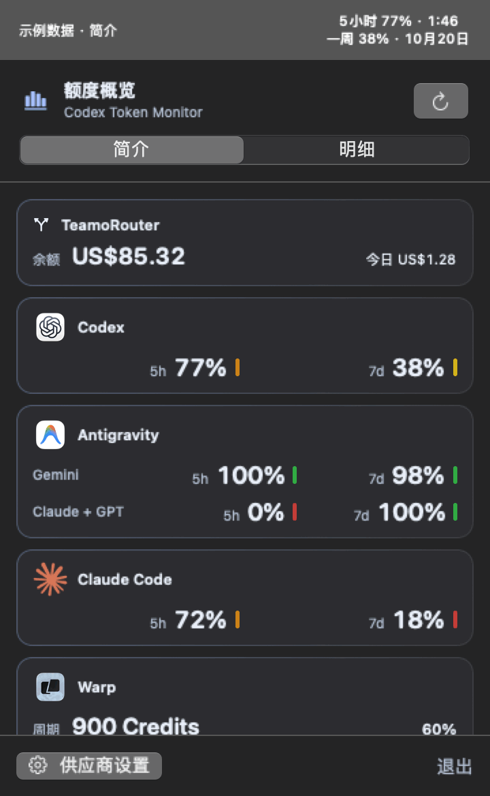
</p>

上方 GIF 由应用原生视图渲染，演示菜单栏双行数据、TeamoRouter 明细与主题切换，使用虚构示例值，不是真实账户录屏。Touch Bar 的各档动画见下方 GIF。

## 功能

- macOS 菜单栏双行显示 5 小时 / 每周余量与重置时间；Windows 托盘数字显示余量，悬浮提示注明两个窗口。
- 点击菜单栏或托盘图标查看账户额度、进度条、重置时间和附加模型额度。
- Codex 每 30 秒自动刷新；macOS v1.4.0 Antigravity 约 60 秒、Claude Code / Warp / TeamoRouter 约 5 分钟，支持手动刷新并遵守限流冷却。
- macOS v1.4.0每次打开默认“简介”，紧凑查看已开启的额度；切换“明细”查看进度条、重置时间、来源和错误。离线品牌 Logo、系统深浅色与等宽数字方便扫读。
- macOS 支持应用内 Touch Bar：显示两个账户窗口的余量、重置时间，并提供刷新按钮和额度联动彩虹猫（v1.3.0 新增）。
- 可配置回写 API，将当前 5 小时与每周剩余额度发送到你的服务。
- 自动回写默认关闭，可设置 1–60 分钟间隔；连续失败 10 次会自动暂停并提示。
- 直接使用本机 Codex 登录凭据请求 OpenAI 额度，不经过第三方 Adapter。
- macOS 使用系统菜单栏模板颜色；Windows 使用独立设置窗口与当前用户加密的 Bearer 存储。

## 多供应商监控（macOS v1.4.0）

同一概览中按供应商展示额度，不合并不同服务、不同模型组的百分比。Codex / Antigravity / Claude 为订阅剩余比例，不是精确 token 数；Warp 按接口返回的 Credits 和周期上限展示；TeamoRouter 展示账户美元余额和当前 Key 的消费、Token 用量，不转换成百分比。

| 供应商 | 读取方式与条件 | 默认开关 / 刷新 |
| --- | --- | --- |
| Codex | 本机 `auth.json` 中有效的 ChatGPT 登录凭据，直连 OpenAI 额度接口 | 开启 / 30 秒 |
| Antigravity | 官方 `agy` CLI ≥ 1.1.11，已在 CLI 登录且账号能使用 `/usage` | 关闭 / 开启后约 60 秒 |
| Claude Code | 默认配置的 Claude 订阅 OAuth 登录；只读本机钥匙串或 `.claude/.credentials.json`，直连 Anthropic 额度接口 | 关闭 / 开启后约 5 分钟 |
| Warp | 在设置中保存个人 `wk-…` API Key 到 macOS 钥匙串，直连 Warp GraphQL；无需 CLI 常驻 | 关闭 / 开启后约 5 分钟 |
| TeamoRouter（Claude Code API） | 从 `~/.zshrc` 导入或手动填写根地址与 `ANTHROPIC_AUTH_TOKEN`，保存到本机钥匙串；也支持进程环境变量 | 关闭 / 开启后约 5 分钟 |

### 开启 Antigravity

1. 按 [Antigravity 官方 CLI 文档](https://antigravity.google/docs/cli/commands/usage) 安装并登录；先在终端确认 `agy --version` 和 `agy -p /usage --output-format json --print-timeout 20s` 可用。
2. 运行本项目，点击菜单栏 → **供应商设置 → 服务与账号**。
3. 在 Antigravity 卡片中检查检测结果。若没有找到 CLI，使用“选择文件…”或填写可执行文件绝对路径，再点“保存路径”。留空时扫描 PATH 和常见安装位置；从 Finder 启动的 App 不一定继承终端的 PATH。
4. 点击“验证连接”。这是一次只读额度查询，不会自动打开监控开关；成功后按需开启 Antigravity。
5. 在“菜单栏与显示”选择“固定显示”或“自动轮播”。可选已开启的 Codex、Antigravity · Gemini、Antigravity · Claude + GPT、Claude Code、Warp 或 TeamoRouter；自动轮播按顺序展示额度组，可设 **5–60 秒**间隔（默认 10 秒）。设置自动保存；关闭轮播后回到所选固定来源。

### 开启 Claude Code（官方订阅）

如果 Claude Code 使用 TeamoRouter 的环境变量 API Key，请使用下方独立的 **TeamoRouter** 配置，而不是本项 OAuth 订阅开关。

1. 按 [Claude Code 官方登录说明](https://code.claude.com/docs/en/authentication) 使用 Claude 订阅账号登录，而非 API Key 或第三方代理。只安装 CLI 不代表已具备订阅 OAuth 凭据。
2. 打开 **供应商设置 → 服务与账号 → Claude Code → 验证连接**。必要时 macOS 会要求允许读取登录钥匙串；后台自动刷新不会主动请求授权。
3. 验证成功后开启 Claude Code 开关；默认关闭，验证一次不会自动启用轮询。无需保持 Claude Code 运行，但登录令牌过期后需在官方客户端重新登录。
4. 在“菜单栏与显示”选择 Claude Code 或开启轮播。`CL` 表示 Claude Code，`C+G` 表示 Antigravity 内的 Claude + GPT，二者不是同一份额度。Touch Bar 同步显示当前来源，小猫仍按该来源两个窗口中较低余量联动。

读取路径：只读默认登录钥匙串的 `Claude Code-credentials` 项；不存在时读取 `~/.claude/.credentials.json` 的 `claudeAiOauth`。不扫描其他钥匙串项目、不存储令牌副本、不修改/刷新登录令牌；当前不支持自定义 `CLAUDE_CONFIG_DIR` 和多账号切换。API Key、Bedrock、Vertex 或代理额度不适用。

请求固定为 `GET https://api.anthropic.com/api/oauth/usage`，携带 OAuth Bearer 与 `anthropic-beta: oauth-2025-04-20`，禁止重定向。读取账户级 `five_hour` / `seven_day` 的 `utilization`，计算 `100 - utilization` 得到剩余百分比；不混入模型专用额度。`resets_at` 转为系统时区日期，未知值显示 `—`。

这是**客户端内部接口，不是 Anthropic 承诺稳定的公共 API**；其社区问题记录包含该端点的请求方式及限流报告，见 [Anthropic 仓库 issue #30930](https://github.com/anthropics/claude-code/issues/30930)。默认 5 分钟查询一次，失败退避最长 1 小时；服务端 `Retry-After` 更长时优先遵守。限流期间手动刷新和开关切换也不会立即重试；401/403、登录缺失或钥匙串访问受限时暂停自动查询，修复后手动验证。

下面是 Claude 设置卡片的原生界面预览，使用测试示例数据：

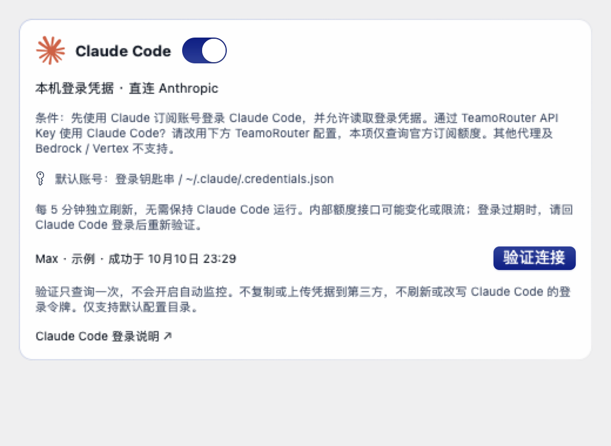

### 开启 TeamoRouter（兼容 Claude Code 环境变量 API Key）

1. 打开 **供应商设置 → 服务与账号 → TeamoRouter**，点击“从 .zshrc 导入”。只读取 `~/.zshrc` 中顶层、单行的 `ANTHROPIC_BASE_URL` 和 `ANTHROPIC_AUTH_TOKEN` 字面量赋值；支持 `export`、单双引号和行尾注释。不执行或修改脚本，不展开变量、不运行命令替换、不追踪 `source`；复杂配置请手动填写。
2. 导入只填入表单，密钥使用安全输入框隐藏。确认 API 地址后点击“保存”，再点“验证连接”。地址和密钥一起存入本应用的 `CodexTokenMonitor.TeamoRouter` 钥匙串项；密钥不进入 UserDefaults、日志、截图或仓库。后台读取不会主动弹授权框。
3. 验证成功后按需开启开关，每 5 分钟刷新。验证本身不会开启自动监控。已保存配置优先；没有保存配置时可使用当前进程的两个环境变量。从 Finder 启动的 `.app` 通常不继承 `.zshrc`，因此推荐导入并保存。
4. 菜单栏选择 TeamoRouter（`TR`）或轮播：第一行账户余额，第二行今日消费。明细显示今日已用 Token、请求数、统计区间和最近成功时间。Touch Bar 同步显示金额；没有总额度分母，不计算百分比，小猫保持睡眠。

按 [TeamoRouter 官方 API 文档](https://api.teamorouter.com/docs/open-api)，使用 Bearer 只读请求：

| 接口 | 展示内容 / 范围 |
| --- | --- |
| `GET /v1/billing/balance` | 当前 Key 所属账户的共享 USD 余额 |
| `GET /v1/billing/costs?start_time=…&end_time=…` | 当前 Key 的今日消费 |
| `GET /v1/usage?start_time=…&end_time=…` | 当前 Key 的今日 Token 用量和请求数 |

“今日”从本机时区的零点起算，消费和用量查询使用相同时间边界，包含该 Key 调用的所有模型，不保证仅来自 Claude Code。API 根地址仅接受 `https://api.teamorouter.com` 或 `https://teamorouter.com`，禁止 HTTP 和重定向；第三方密钥不会发送给 Anthropic。错误不当作零余额；401/403 或缺失凭据暂停自动查询，429 遵守 `Retry-After`，其他失败退避至最长 1 小时。不会执行模型请求、购买余额、改变 Claude 登录状态，也不会把此数据回写到 Codex 回写接口。

已使用本机 `.zshrc` 配置完成三个接口的真实只读验证；下面的界面截图仍使用测试示例数据，不含真实账户信息。可自行运行 `TEAMO_LIVE_CHECK=1 swift test --filter teamoLiveReadFromZshrc` 复核（仅输出查询汇总，不输出密钥；不会保存或开启配置）。

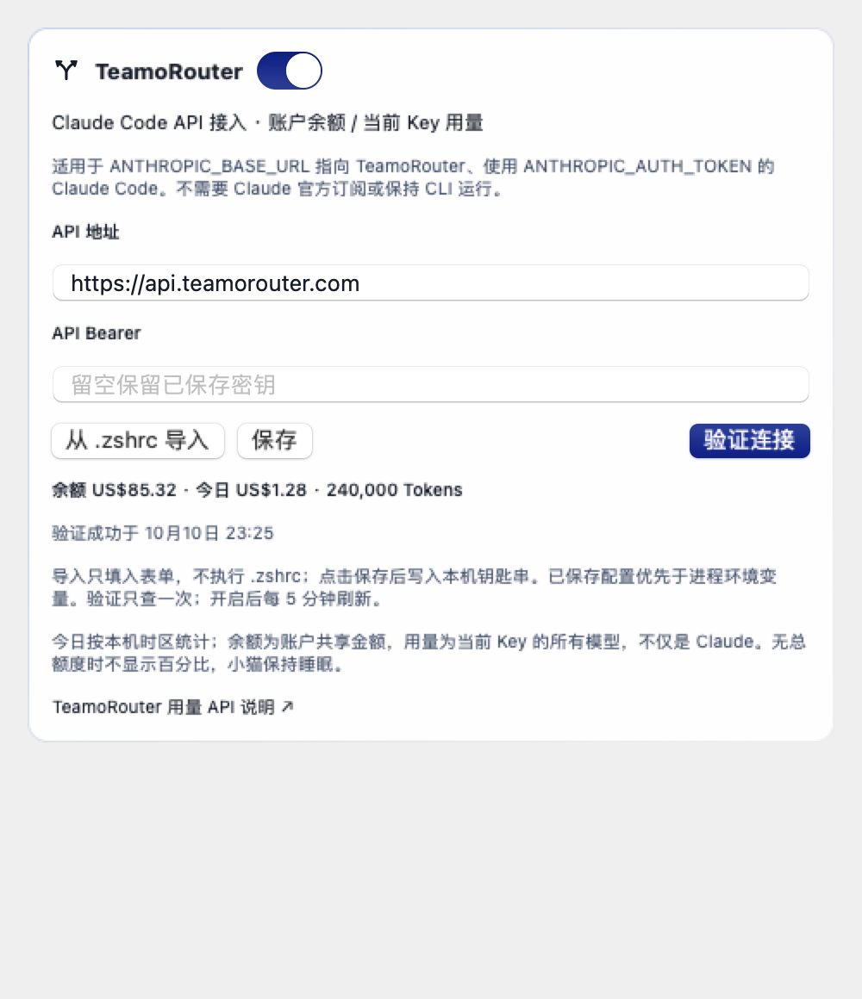
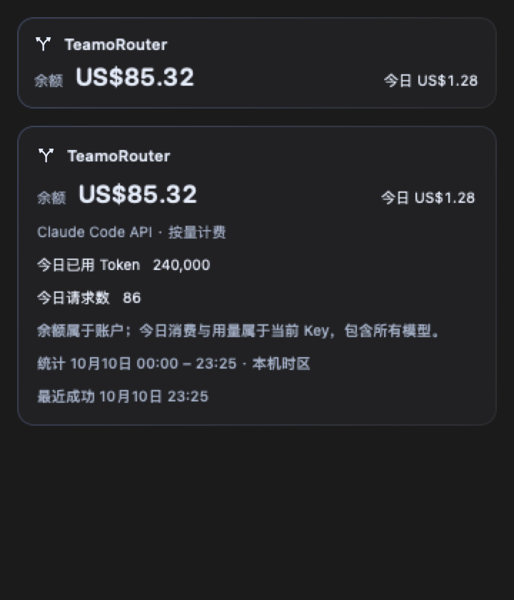

### 开启 Warp

1. 按 [Warp 官方 API Key 文档](https://docs.warp.dev/agents/cli/oz-cli/api-keys/) 创建**个人 API Key**（`wk-…`），不要使用团队 Agent Key。
2. 在 **供应商设置 → 服务与账号 → Warp** 输入密钥，点击“保存密钥”，再点击“验证连接”。密钥只存入本应用专用 macOS 钥匙串项，不存入 UserDefaults，不回显到输入框，也不写日志。
3. 验证成功后按需开启。验证一次不会自动启用监控；开启后约每 5 分钟刷新，无需保持 Warp 或 CLI 运行。
4. 菜单栏选择 Warp 或开启轮播；两行显示周期剩余 Credits 和重置日期，Touch Bar 同步显示周期与个人额外 Credits。

请求固定为 `POST https://app.warp.dev/graphql/v2?op=GetRequestLimitInfo`，通过 Bearer 鉴权执行只读 GraphQL 查询并禁止重定向。这是 **Warp 客户端内部额度接口，不保证长期稳定**。协议参考 [CodexBar 的 Warp 实现](https://github.com/steipete/CodexBar/blob/main/Sources/CodexBarCore/Providers/Warp/WarpUsageFetcher.swift)，本项目独立实现解析与安全边界。

周期剩余量为 `max(0, requestLimit - requestsUsedSinceLastRefresh)`；有效上限 >0 才计算百分比。无上限明确标记，缺失数据为 `—`，不伪造 5 小时 / 每周窗口。只统计个人 `bonusGrants` 的未过期 Credits，不请求或汇总工作区余额；此接入不支持团队额度。限流遵守 `Retry-After`（包括手动验证和开关切换），失败退避最长 1 小时；401/403 或缺少密钥时暂停自动查询。

**验证边界：当前已完成离线解析、状态、界面和 Touch Bar 测试；尚未用真实 Warp 个人 API Key 完成端到端验证。** 本应用不读取或刷新 Warp 私有登录会话，请在设置中输入密钥，不要把密钥发到 issue 或聊天里。

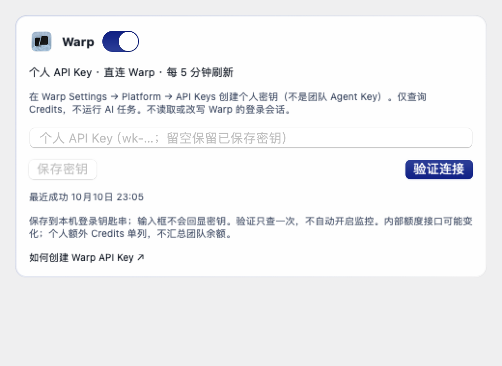

### 简介 / 明细与轮播

每次打开弹窗默认“简介”，已开启的供应商可紧凑查看；“明细”保留完整错误、重置时间、数据来源和成功时间。切换模式不会触发接口请求。Logo 离线打包，来源见 [品牌资源说明](docs/provider-logo-sources.md)；TeamoRouter 暂使用原生路由符号与名称，不冒用 Claude 的 Logo。

### 外观主题（macOS v1.4.0）

在 **供应商设置 → 外观** 中选择主题，点击即时应用并自动保存，无需重启：

| 主题 | 视觉风格 |
| --- | --- |
| 原生 · 清透（默认） | 系统感材质、干净留白、轻量边框 |
| 极光 · 微光 | 蓝紫与青色柔光、柔和阴影、边缘高光 |
| 深空 · 石墨 | 石墨背景、冰蓝点缀、精细分隔 |

三套主题均提供浅色和深色，可选跟随系统；弹窗、简介 / 明细及设置使用统一样式。菜单栏仍为系统单色，品牌 Logo、额度警告颜色、读取频率与 Touch Bar 小猫规则不变。

动效可选“轻柔 / 关闭”。轻柔模式提供切换淡入淡出、数值与进度过渡，以及**真实刷新成功**时的短暂卡片高光；不使用持续粒子或闪烁动画。关闭弹窗或离开应用后不播放弹窗动效。系统“减少动态效果”优先关闭动画；“减少透明度 / 增强对比度”使用实色背景，增强对比度时加强边界。

以下由原生界面渲染，使用测试示例数据；静态截图不展示过渡动效：

<p>
  
  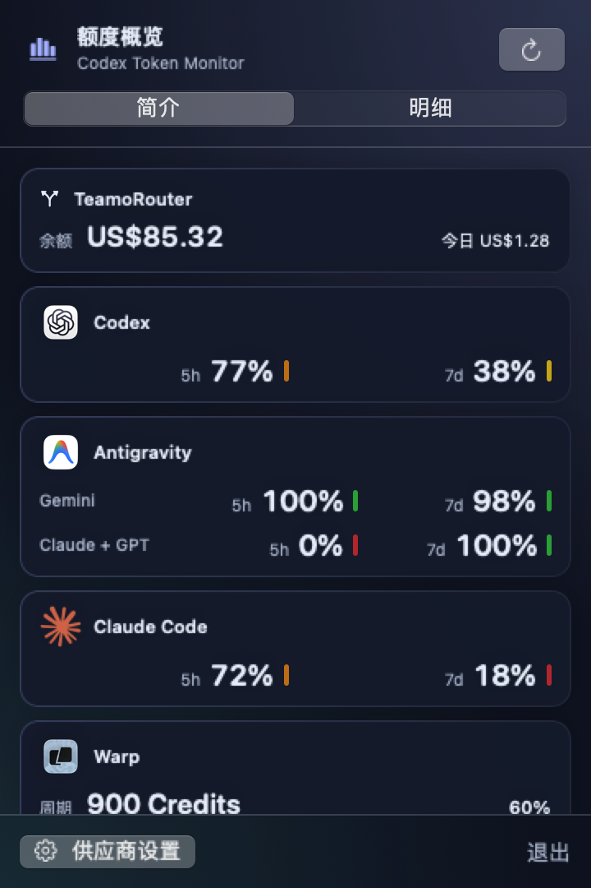
  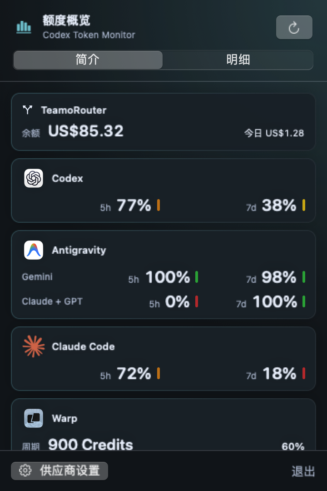
</p>

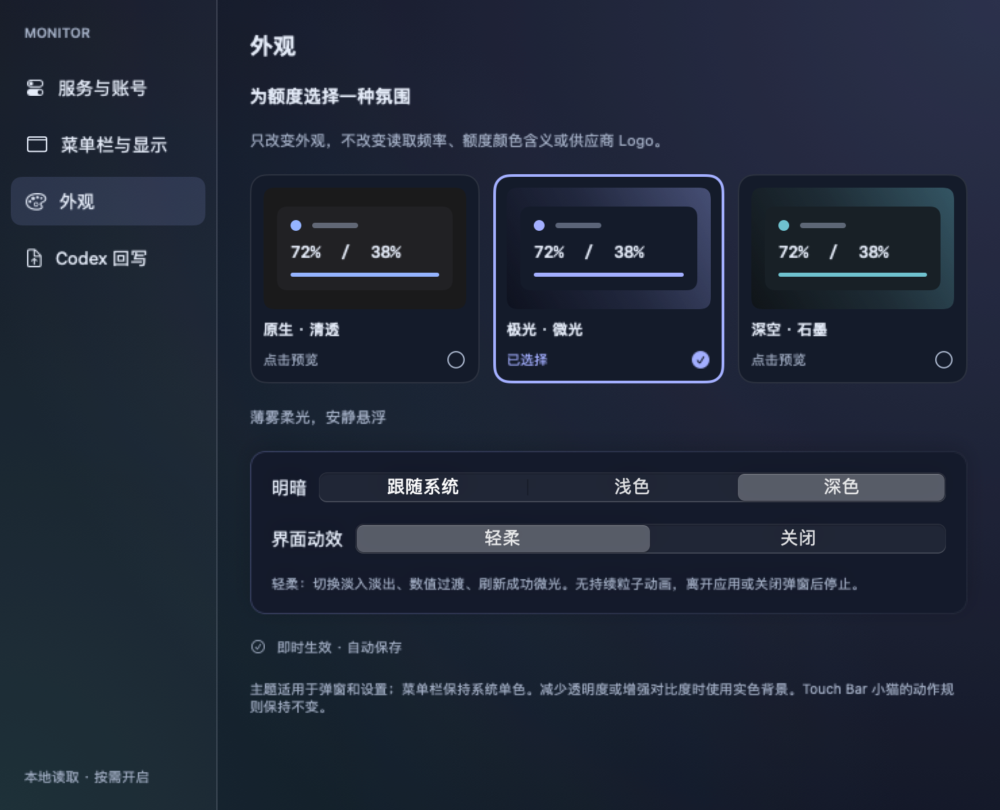

轮播仅切换已读取的数据，不增加接口请求。只有一个额度组时保持显示；没有开启服务时显示“未启用”。额度弹窗打开期间暂停轮播，关闭后等待一个间隔再继续，避免切换内容影响弹窗对齐。概览始终可滚动查看全部已开启项。

Gemini 与 Claude + GPT 的 5 小时 / 每周额度分别显示，重置日期和时间使用系统时区。每个供应商记录独立的最近成功时间；缺少窗口或读取失败时显示 `—`，不会用 0% 或 100% 代替未知值。

以下预览由原生 SwiftUI 界面渲染，**使用测试示例数据，并非真实账号截图**；概览下半部分可滚动。

<p>
  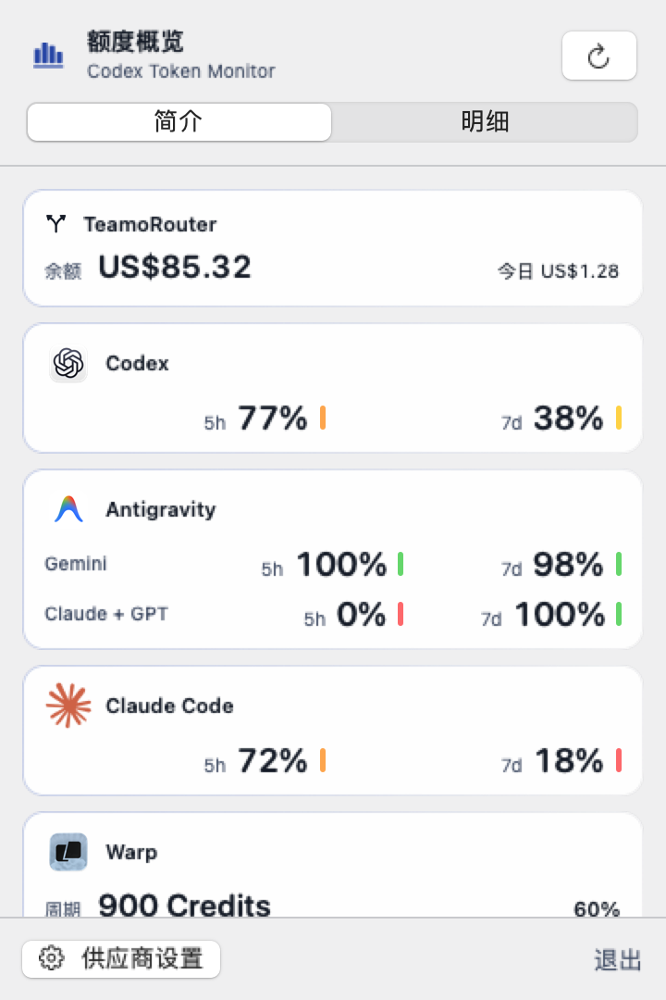
  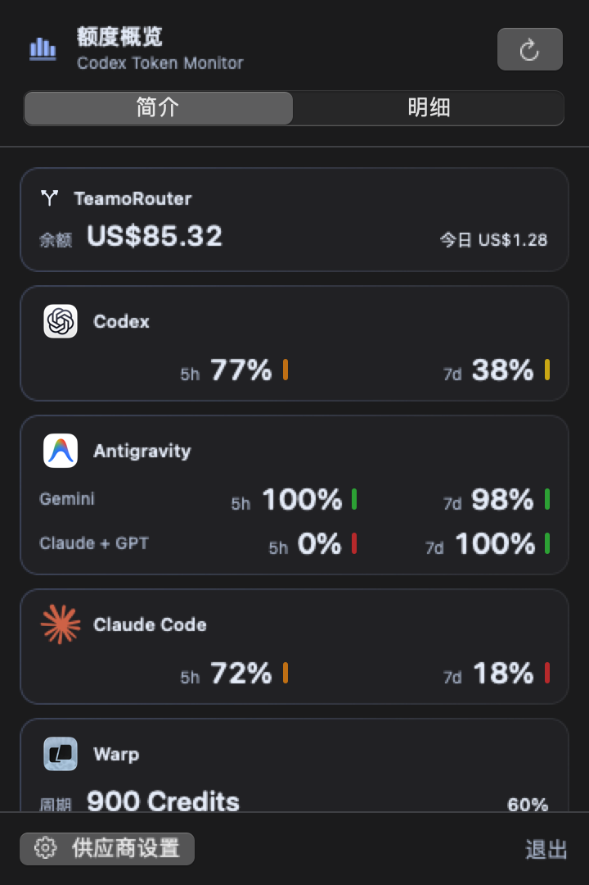
</p>

<p>
  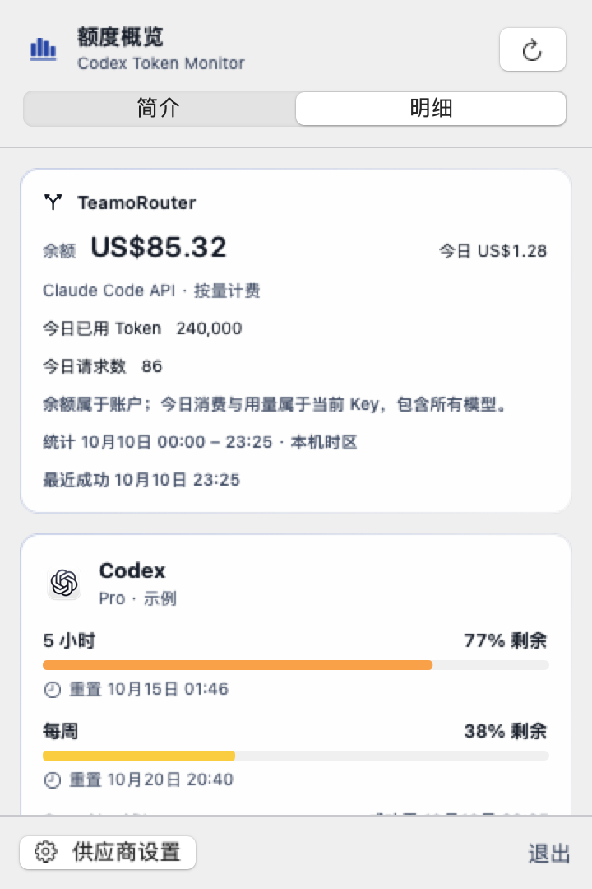
  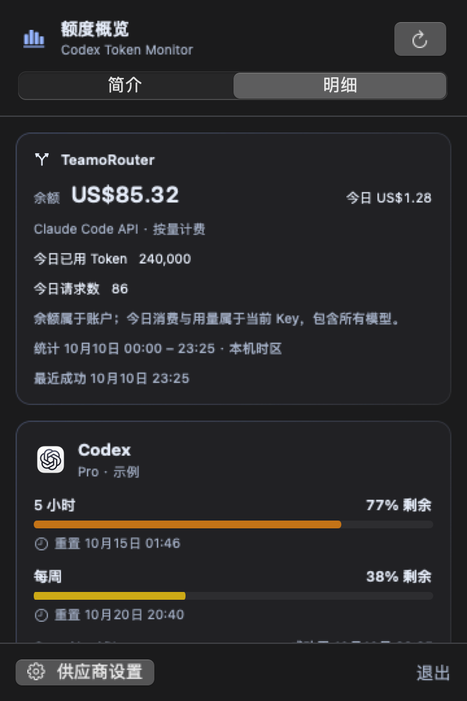
</p>

<p>
  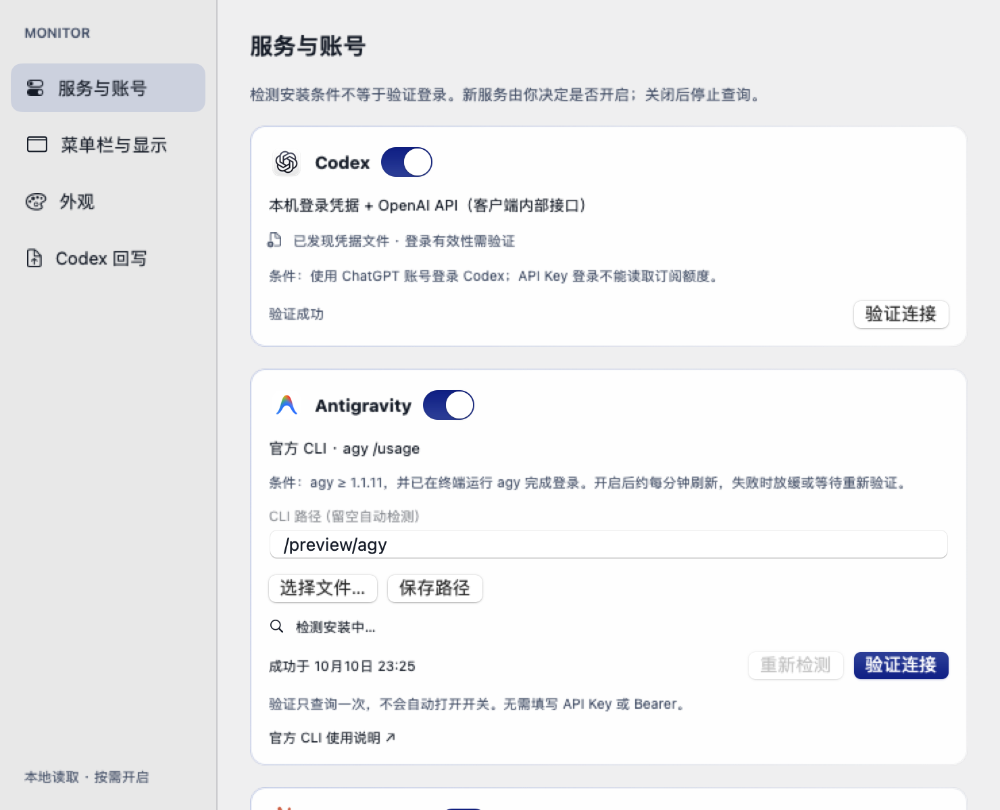
</p>

<p>
  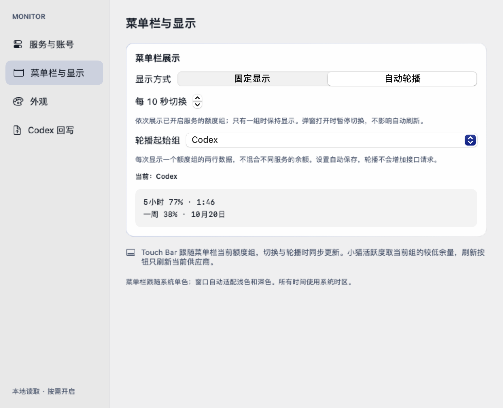
</p>

### 刷新、安全与当前边界

- 关闭供应商会取消本应用发起的额度查询并忽略迟到结果；不会结束用户自行启动的 CLI。手动“验证连接”可在 Antigravity 关闭时查询一次。
- Antigravity 查询在后台运行，单次最长 30 秒、输出最多 512 KiB；失败后逐步放缓到最多 15 分钟。未安装、路径/版本不符、登录/权限错误或误识别为对话时暂停自动查询，修复后手动验证。
- 仅执行 `--version` 和 `/usage`，不发送模型任务；使用独立临时工作目录。登录与凭据由官方 CLI 管理，本应用不复制 Antigravity 凭据，不显示原始 CLI 错误输出。
- 安装检测只证明找到 CLI，不代表登录有效。应用不自动安装 CLI、不自动发起登录、不自动启用新服务。
- **回写仍仅关联 Codex**；Antigravity、Claude Code、Warp 数据不会进入现有回写接口。关闭 Codex 会停止后续自动回写，已经发出的请求无法撤回。
- **Touch Bar 跟随菜单栏当前额度组**，手动切换和轮播均同步进度、重置时间及小猫状态，刷新按钮只刷新所选供应商。窗口缺失、读取中或失败不会回退成其他供应商的额度。
- Windows 本轮不变；其他供应商、多账号、余额指标和历史趋势尚未接入。开发范围见 [阶段 A 规格](docs/multi-provider-spec.md)。

## 安装

在 [GitHub Releases](https://github.com/Naja404/codex-token-monitor/releases) 选择对应平台附件：

| 平台 | v1.4.0 下载 | 使用方式 |
| --- | --- | --- |
| macOS 14+ / Apple Silicon | [macOS arm64 ZIP](https://github.com/Naja404/codex-token-monitor/releases/download/v1.4.0/Codex-Token-Monitor-macOS-arm64.zip) | 解压，将 `.app` 拖入“应用程序” |
| Windows 10/11 / x64 | [Windows x64 ZIP](https://github.com/Naja404/codex-token-monitor/releases/download/v1.4.0/Codex-Token-Monitor-Windows-x64.zip) | 原有 Codex 托盘功能；解压运行 `CodexTokenMonitor.exe`，无需另装 .NET |

### macOS

1. 下载 `Codex-Token-Monitor-macOS-arm64.zip`。
2. 解压后，将 `Codex Token Monitor.app` 拖入“应用程序”。
3. 首次打开如被 Gatekeeper 拦截，请在 Finder 中右键应用，选择“打开”。
4. 在此 Mac 上登录 Codex 后启动应用；菜单栏会显示真实额度。

### Windows

1. 在 Windows 本机使用 ChatGPT 账号登录 Codex，生成 `%USERPROFILE%\.codex\auth.json`。
2. 解压 Windows ZIP 后运行 `CodexTokenMonitor.exe`，图标位于任务栏右下角（可能在隐藏图标区域）。
3. 点击图标查看详情，失焦或按 Escape 收起；右键提供刷新、回写设置与退出。
4. 托盘数字优先显示账户 5 小时余量，缺失时显示周余量；悬浮提示注明两者。

Windows 首版已完成数据逻辑检查和编译；托盘交互、多屏缩放、DPAPI 配置恢复仍需实机验收。上方截图为 macOS v1.4.0界面；Windows 外观不同，本轮不包含多供应商功能。

### Touch Bar（macOS v1.3.0+）

以下 GIF 由当前源码的实际绘制代码生成，展示 Touch Bar 的额度区域，并非真机录屏。额度和重置时间均为示例数据；活跃程度取两个账户窗口中较低的余量。新版自然步态及快跑全身起伏已包含在 v1.3.1 安装包中。

#### 快跑 · 余量 ≥80%

示例：90% / 88%，按 88% 联动。每轮 0.48 秒，彩虹最长。使用独立奔跑步态：前足前伸、后足后蹬，再向腹下收拢；蹬地后身体整体抬升，落地时下沉，头部和腿根同步跟随，腾空阶段四足离地。


#### 小跑 · 余量 50–79%

示例：60% / 88%，按 60% 联动。每轮 0.8 秒，对角腿配合。


#### 慢走 · 余量 20–49%

示例：35% / 88%，按 35% 联动。每轮 1.6 秒，四足错开落地。


#### 打盹 · 余量 10–19%（v1.4.0）

示例：10% / 88%，按 10% 联动。每轮 2.8 秒，闭眼轻微起伏，彩虹变淡。


#### 熟睡 · 余量 <10%（v1.4.0）

示例：5% / 88%，小猫趴下、收脚、闭眼，慢慢呼吸，Zzz 向右上方错峰漂浮并逐渐淡出，不再走动。10% 恢复原来的打盹动作，20% 及以上的步态不变。

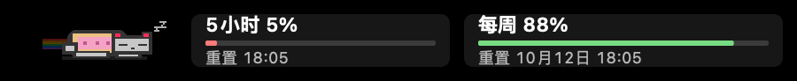

#### 无数据 · 熟睡（v1.4.0）

没有可用百分比时也熟睡，但额度仍显示占位符；读取中显示“读取中”。未知不等同于 0%。


#### 使用说明

在带 Touch Bar 的 MacBook Pro 上，点击菜单栏打开 Monitor 弹窗后，Touch Bar 显示 5 小时 / 每周余量和重置时间；v1.4.0 也支持设置窗口获得焦点时显示同一套额度与彩虹猫。每周包含月、日和时分。v1.4.0 点击“刷新”查询菜单栏当前供应商，读取中或限流冷却时禁用按钮；缺失数据使用 `—`，手动备用数据会注明“手动”。

额度使用迷你条形图展示当前剩余比例（不是历史趋势）。v1.4.0 彩虹猫按当前额度组较低的剩余百分比联动：≥80% 快跑、50–79% 小跑、20–49% 慢走、10–19% 打盹、<10% 或无有效数据时熟睡。Warp 使用周期剩余百分比，不混入额外 Credits；无上限没有可计算百分比，也显示熟睡。手动备用值可预览动作。仅在 Monitor 激活且弹窗或设置窗口正在使用时播放动画；离开应用后停止，系统“减少动态效果”开启时静止。菜单栏轮播时同步关联当前额度组。

跑动采用 12 帧循环：慢走时四足错开落地，小跑时对角腿配合；脚掌沿固定地面后蹬，膝肘弯曲后抬脚前收，头部和耳朵轻微跟随，配合摆尾、全身起伏与流动彩虹。帧循环思路参考 [klange/nyancat](https://github.com/klange/nyancat)；使用自绘像素图形，未引入该项目图片、音频或源代码。AppKit 定时重绘缓存帧；熟睡状态每轮 3.6 秒轻微呼吸，Zzz 缓慢上漂、淡出，不运行步态动画。

使用 Apple 官方 AppKit `NSTouchBar` 接口，显式提供原生控件；新版源码在弹窗和设置窗口之间复用同一 Touch Bar，获得焦点时恢复显示。切换到其他应用后由系统切换内容，不在后台常驻，也不修改系统控制条。若系统设置为只显示“展开的控制条”或功能键，请在“系统设置 → 键盘 → Touch Bar 设置”中选择“App 控制”。没有 Touch Bar 的 Mac 继续使用菜单栏，不受影响。

Touch Bar 功能自 v1.3.0 起提供，v1.3.1 更新了步态，也可从源码构建。原生 Touch Bar 已在 M1 + macOS 14.8 上确认能显示；最新跑动效果仍需实机体验。显示、额度联动和动画启停逻辑可通过 `swift test` 验证。

## 运行环境

| 项目 | macOS | Windows |
| --- | --- | --- |
| 硬件 | Apple Silicon Mac | Intel / AMD x64 PC |
| 系统 | macOS 14（Sonoma）或更高版本 | Windows 10/11 |
| 登录凭据 | `~/.codex/auth.json`；新版源码支持 `CODEX_HOME`，Antigravity 使用 CLI 登录 | `%USERPROFILE%\.codex\auth.json`，支持 `CODEX_HOME` |
| 使用发布包 | 不需要开发工具 | 不需要开发工具或另装 .NET |
| 从源码构建 | Swift 6 / Xcode Command Line Tools | .NET 10 SDK |
| 网络 | 能够访问已开启供应商的服务（OpenAI / ChatGPT、Antigravity）及自行配置的回写服务 | OpenAI / ChatGPT 及自行配置的回写服务 |

## Windows 版（新增）

新增 Windows 10/11 x64 托盘应用，支持套餐识别、额度刷新、附加模型额度与定时回写。免安装 ZIP 自带 .NET 运行时。使用方式、构建命令和实机验收项见 [Windows 说明](windows/README.md)。Windows GUI 仍需实机验证。

## 数据与隐私

应用读取本机 Codex `auth.json` 内保存的 ChatGPT 登录凭据，并请求 OpenAI 的 `https://chatgpt.com/backend-api/wham/usage` 获取当前账号额度。读取时不要求 Codex 窗口保持开启，但凭据必须有效。Windows 不会自动读取 WSL、其他设备或仅存于凭据库中的登录信息；HTTP 401 时请重新登录 Codex。

- 不读取或上传你的提示词、代码或聊天内容。
- 不写入或修改 Codex 凭据。
- 不使用第三方 Adapter 或中转服务。
- 未登录、凭据失效或接口不可用时，界面显示占位符。
- Windows 配置保存在 `%LOCALAPPDATA%\CodexTokenMonitor\settings.json`，Bearer 使用 DPAPI 当前用户加密；macOS 配置使用本机 UserDefaults。

### 套餐与额度识别

详情面板根据接口的 `plan_type` 显示 Free、Plus、Pro、Business（包含旧 `team` 值）、Enterprise 或 Edu；未知类型保留原始值。此字段不用于推断企业席位的具体档位，也不保证账号一定有额度窗口。

- 账户额度按 `limit_window_seconds` 识别：18000 秒对应 5 小时，604800 秒对应每周，不依赖窗口排列顺序。
- 仅提供一个窗口时，另一个显示“接口未提供此窗口”，菜单栏显示 `—`。
- `additional_rate_limits` 单独显示名称、模型及剩余额度，不替代账户额度。
- 自动回写仅在成功读取两个账户窗口后执行；缺失窗口时跳过，不计入连续回写失败。手动回写会提示原因，不会用附加额度或手动值代替。

切换测试账号后，在 Codex 中完成登录，再点击监控器刷新。可检查套餐标签、两个账户窗口以及附加额度；以上分支已用模拟响应测试，各套餐真实返回仍需对应账号验证。

## 从源码运行

### macOS

需要 macOS 14+ 与 Xcode Command Line Tools。

```bash
git clone https://github.com/Naja404/codex-token-monitor.git
cd codex-token-monitor
swift run
```

这是菜单栏常驻应用，`swift run` 完成编译后会持续运行，不会回到终端提示符；请直接查看 macOS 菜单栏。终端出现“已启动”后，按 `Ctrl-C` 可退出。

修改源码后请先退出旧进程再重新运行，避免菜单栏同时存在多个版本。新版入口为 `Sources/AppMain.swift`，供应商状态、CLI 读取与设置界面分别位于 `ProviderStore.swift`、`AntigravityReader.swift` 和 `ProviderViews.swift`，不再是单文件应用。

```bash
swift test
swift build -c release
# 可选：使用本机已登录的官方 CLI 做一次真实额度测试（默认测试不会联网查询）
ANTIGRAVITY_LIVE_CLI="$(command -v agy)" swift test --filter readsInstalledAntigravityCLI
```

### Windows

克隆仓库后，在 Windows 上安装 .NET 10 SDK，执行：

```powershell
dotnet run --project windows/Checks -c Release
dotnet run --project windows/App -c Release
```

构建免安装 EXE 和实机验收清单见 [Windows README](windows/README.md)。

## 发布新版本

更新 `Packaging/Info.plist`、`windows/App/App.csproj` 及 Windows manifest 的版本后，推送尚未使用的 `v` 前缀标签。GitHub Actions 会构建 macOS arm64 和 Windows x64 ZIP，并添加到同一 Release。Windows 附件会在 macOS Release 创建及 Windows 构建成功后上传。

```bash
# 示例：使用尚未发布的新版本号
git tag v1.3.2
git push origin v1.3.2
```

## 已知限制

- 本工具显示 ChatGPT/Codex 订阅额度，不是 OpenAI API key 的 API 限流数据。
- 此额度接口未作为公开稳定 SDK 契约发布；OpenAI 或 Codex 的内部实现变化可能影响读取结果。
- macOS 使用 ad-hoc 签名，尚未经过 Apple 公证；Windows EXE 尚未进行代码签名。
- Windows 首版暂不提供手动额度编辑、MSI 安装器或原生 ARM64 包；托盘交互和多屏定位仍需实机验收。

## 回写 Token 余量

新版 macOS v1.4.0 在“供应商设置 → Codex 回写”中配置；v1.3.1 与 Windows 仍使用原回写设置入口。填写 API 地址、Bearer 和 Codex Key ID，再点击“保存配置”。“验证连接”会发送一次当前 Codex 额度请求确认接口和凭据有效；“立即回写”用于手动发送。应用使用 `POST` 请求并发送以下 JSON（Bearer 只放在 `Authorization` 请求头，不会进入 body）：

```json
{
  "codex_key_id": "codex-8761b8cc2e114f59",
  "five_hour": {
    "remaining_percent": 27,
    "reset_time": "20:50"
  },
  "seven_day": {
    "remaining_percent": 82,
    "reset_date": "9月6日 16:48"
  }
}
```

## License

[MIT License](LICENSE) © 2026 Naja404。
