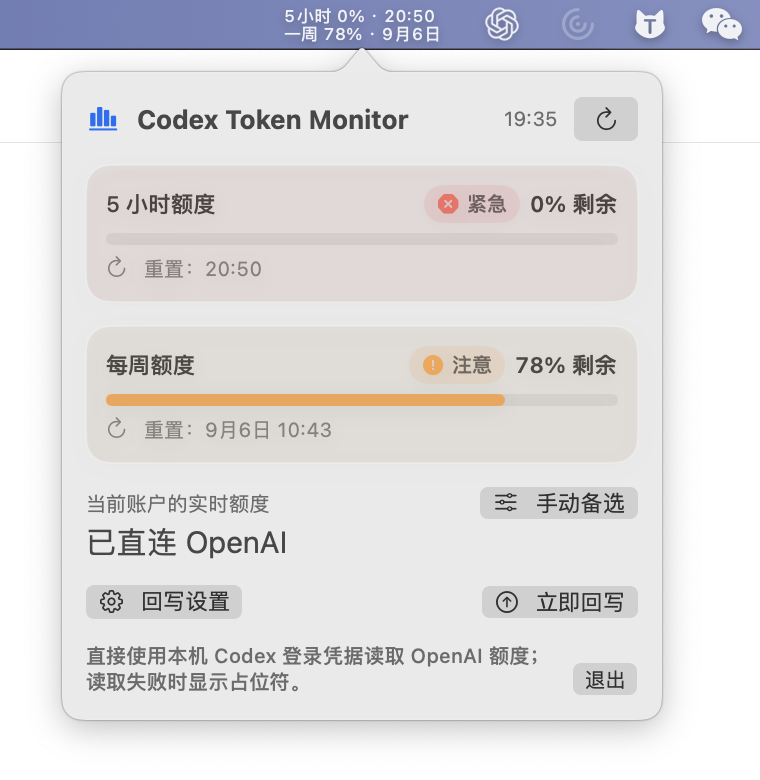
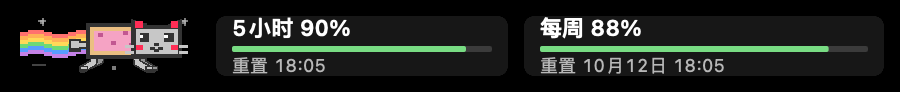
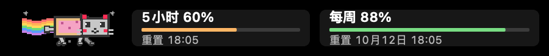
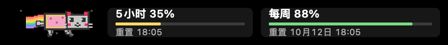
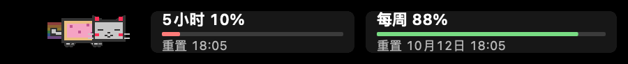
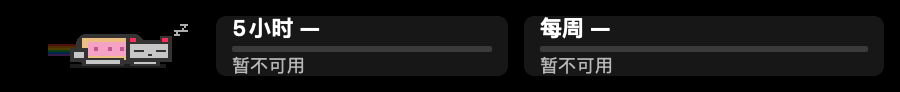

# Codex Token Monitor

<p align="center">
  
</p>

<p align="center">在 macOS 菜单栏或 Windows 系统托盘中查看 Codex 订阅额度。</p>

<p align="center">
  
</p>

## 功能

- macOS 菜单栏双行显示 5 小时 / 每周余量与重置时间；Windows 托盘数字显示余量，悬浮提示注明两个窗口。
- 点击菜单栏或托盘图标查看账户额度、进度条、重置时间和附加模型额度。
- 每 30 秒自动刷新，支持手动立即刷新。
- macOS 支持应用内 Touch Bar：显示两个账户窗口的余量、重置时间，并提供刷新按钮和额度联动彩虹猫（v1.3.0 新增）。
- 可配置回写 API，将当前 5 小时与每周剩余额度发送到你的服务。
- 自动回写默认关闭，可设置 1–60 分钟间隔；连续失败 10 次会自动暂停并提示。
- 直接使用本机 Codex 登录凭据请求 OpenAI 额度，不经过第三方 Adapter。
- macOS 使用系统菜单栏模板颜色；Windows 使用独立设置窗口与当前用户加密的 Bearer 存储。

## 安装

在 [GitHub Releases](https://github.com/Naja404/codex-token-monitor/releases) 选择对应平台附件：

| 平台 | v1.3.1 下载 | 使用方式 |
| --- | --- | --- |
| macOS 14+ / Apple Silicon | [macOS arm64 ZIP](https://github.com/Naja404/codex-token-monitor/releases/download/v1.3.1/Codex-Token-Monitor-macOS-arm64.zip) | 解压，将 `.app` 拖入“应用程序” |
| Windows 10/11 / x64 | [Windows x64 ZIP](https://github.com/Naja404/codex-token-monitor/releases/download/v1.3.1/Codex-Token-Monitor-Windows-x64.zip) | 解压运行 `CodexTokenMonitor.exe`，无需另装 .NET |

### macOS

1. 下载 `Codex-Token-Monitor-macOS-arm64.zip`。
2. 解压后，将 `Codex Token Monitor.app` 拖入“应用程序”。
3. 首次打开如被 Gatekeeper 拦截，请在 Finder 中右键应用，选择“打开”。
4. 在此 Mac 上登录 Codex 后启动应用；菜单栏会显示真实额度。

### Windows

1. 在 Windows 本机使用 ChatGPT 账号登录 Codex，生成 `%USERPROFILE%\.codex\auth.json`。
2. 解压 Windows ZIP 后运行 `CodexTokenMonitor.exe`，图标位于任务栏右下角（可能在隐藏图标区域）。
3. 点击图标查看详情，失焦或按 Escape 收起；右键提供刷新、回写设置与退出。
4. 托盘数字优先显示账户 5 小时余量，缺失时显示周余量；悬浮提示注明两者。

Windows 首版已完成数据逻辑检查和编译；托盘交互、多屏缩放、DPAPI 配置恢复仍需实机验收。上方截图为旧版 macOS 界面，尚未包含套餐标签及附加额度；Windows 外观不同。

### Touch Bar（macOS v1.3.0+）

以下 GIF 由当前源码的实际绘制代码生成，展示 Touch Bar 的额度区域，并非真机录屏。额度和重置时间均为示例数据；活跃程度取两个账户窗口中较低的余量。新版自然步态及快跑全身起伏已包含在 v1.3.1 安装包中。

#### 快跑 · 余量 ≥80%

示例：90% / 88%，按 88% 联动。每轮 0.48 秒，彩虹最长。使用独立奔跑步态：前足前伸、后足后蹬，再向腹下收拢；蹬地后身体整体抬升，落地时下沉，头部和腿根同步跟随，腾空阶段四足离地。



#### 小跑 · 余量 50–79%

示例：60% / 88%，按 60% 联动。每轮 0.8 秒，对角腿配合。



#### 慢走 · 余量 20–49%

示例：35% / 88%，按 35% 联动。每轮 1.6 秒，四足错开落地。



#### 打盹 · 余量 <20%

示例：10% / 88%，按 10% 联动。每轮 2.8 秒，闭眼轻微起伏，彩虹变淡。



#### 无数据 · 静止

示例为读取失败：额度显示占位符，灰色彩虹保持静止。读取中也使用静止状态，但文字显示“读取中”。



#### 使用说明

在带 Touch Bar 的 MacBook Pro 上，点击菜单栏打开 Monitor 弹窗后，Touch Bar 显示 5 小时 / 每周余量和重置时间；每周包含月、日和时分。点击“刷新”复用现有额度请求，读取中禁用按钮；缺失数据使用 `—`，手动备用数据会注明“手动”。

额度使用迷你条形图展示当前剩余比例（不是历史趋势），配有大耳朵、四肢跑动的像素彩虹猫。色彩沿用绿 / 橙 / 黄 / 红的额度分级；彩虹猫按两个账户窗口中较低的剩余百分比联动（仅有一个窗口时使用该窗口，不使用附加模型额度）：≥80% 快跑、50–79% 小跑、20–49% 慢走、<20% 眯眼打盹。手动备用值也可用于预览动效；读取中或不可用时静止，不编造余量。仅弹窗打开时动画，关闭弹窗即停止，尊重系统“减少动态效果”。空间不足时优先隐藏装饰，不影响额度与刷新操作。

跑动采用 12 帧循环：慢走时四足错开落地，小跑时对角腿配合；脚掌沿固定地面后蹬，膝肘弯曲后抬脚前收，头部保持平稳、耳朵轻微跟随，配合摆尾、身体起伏、流动彩虹和向后移动的星点。帧循环思路参考 [klange/nyancat](https://github.com/klange/nyancat)；这里使用自绘像素图形和本地绘制代码，未引入该项目的图片、音频或源代码。由主线程定时切换缓存帧并触发 AppKit 重绘，不再仅依赖图层动画；无需下载资源。减少动态效果开启、额度读取中或不可用时，彩虹猫会保持静止。

使用 Apple 官方 AppKit `NSTouchBar` 接口，由弹窗控制器显式提供原生控件，仅在 Monitor 激活并打开弹窗时显示，切换到其他应用后由系统切换内容；不在后台常驻，也不修改系统控制条。若系统设置为只显示“展开的控制条”或功能键，请在“系统设置 → 键盘 → Touch Bar 设置”中选择“App 控制”。没有 Touch Bar 的 Mac 继续使用菜单栏，不受影响。

Touch Bar 功能自 v1.3.0 起提供，v1.3.1 更新了步态，也可从源码构建。原生 Touch Bar 已在 M1 + macOS 14.8 上确认能显示；最新跑动效果仍需实机体验。显示、额度联动和动画启停逻辑可通过 `swift test` 验证。

## 运行环境

| 项目 | macOS | Windows |
| --- | --- | --- |
| 硬件 | Apple Silicon Mac | Intel / AMD x64 PC |
| 系统 | macOS 14（Sonoma）或更高版本 | Windows 10/11 |
| 登录凭据 | `~/.codex/auth.json` | `%USERPROFILE%\.codex\auth.json`，支持 `CODEX_HOME` |
| 使用发布包 | 不需要开发工具 | 不需要开发工具或另装 .NET |
| 从源码构建 | Swift 6 / Xcode Command Line Tools | .NET 10 SDK |
| 网络 | 能够访问 OpenAI / ChatGPT 及自行配置的回写服务 | 同左 |

## Windows 版（新增）

新增 Windows 10/11 x64 托盘应用，支持套餐识别、额度刷新、附加模型额度与定时回写。免安装 ZIP 自带 .NET 运行时。使用方式、构建命令和实机验收项见 [Windows 说明](windows/README.md)。Windows GUI 仍需实机验证。

## 数据与隐私

应用读取本机 Codex `auth.json` 内保存的 ChatGPT 登录凭据，并请求 OpenAI 的 `https://chatgpt.com/backend-api/wham/usage` 获取当前账号额度。读取时不要求 Codex 窗口保持开启，但凭据必须有效。Windows 不会自动读取 WSL、其他设备或仅存于凭据库中的登录信息；HTTP 401 时请重新登录 Codex。

- 不读取或上传你的提示词、代码或聊天内容。
- 不写入或修改 Codex 凭据。
- 不使用第三方 Adapter 或中转服务。
- 未登录、凭据失效或接口不可用时，界面显示占位符。
- Windows 配置保存在 `%LOCALAPPDATA%\CodexTokenMonitor\settings.json`，Bearer 使用 DPAPI 当前用户加密；macOS 配置使用本机 UserDefaults。

### 套餐与额度识别

详情面板根据接口的 `plan_type` 显示 Free、Plus、Pro、Business（包含旧 `team` 值）、Enterprise 或 Edu；未知类型保留原始值。此字段不用于推断企业席位的具体档位，也不保证账号一定有额度窗口。

- 账户额度按 `limit_window_seconds` 识别：18000 秒对应 5 小时，604800 秒对应每周，不依赖窗口排列顺序。
- 仅提供一个窗口时，另一个显示“接口未提供此窗口”，菜单栏显示 `—`。
- `additional_rate_limits` 单独显示名称、模型及剩余额度，不替代账户额度。
- 自动回写仅在成功读取两个账户窗口后执行；缺失窗口时跳过，不计入连续回写失败。手动回写会提示原因，不会用附加额度或手动值代替。

切换测试账号后，在 Codex 中完成登录，再点击监控器刷新。可检查套餐标签、两个账户窗口以及附加额度；以上分支已用模拟响应测试，各套餐真实返回仍需对应账号验证。

## 从源码运行

### macOS

需要 macOS 14+ 与 Xcode Command Line Tools。

```bash
git clone https://github.com/Naja404/codex-token-monitor.git
cd codex-token-monitor
swift run
```

这是菜单栏常驻应用，`swift run` 完成编译后会持续运行，不会回到终端提示符；请直接查看 macOS 菜单栏。终端出现“已启动”后，按 `Ctrl-C` 可退出。

### Windows

克隆仓库后，在 Windows 上安装 .NET 10 SDK，执行：

```powershell
dotnet run --project windows/Checks -c Release
dotnet run --project windows/App -c Release
```

构建免安装 EXE 和实机验收清单见 [Windows README](windows/README.md)。

## 发布新版本

更新 `Packaging/Info.plist`、`windows/App/App.csproj` 及 Windows manifest 的版本后，推送尚未使用的 `v` 前缀标签。GitHub Actions 会构建 macOS arm64 和 Windows x64 ZIP，并添加到同一 Release。Windows 附件会在 macOS Release 创建及 Windows 构建成功后上传。

```bash
# 示例：使用尚未发布的新版本号
git tag v1.3.2
git push origin v1.3.2
```

## 已知限制

- 本工具显示 ChatGPT/Codex 订阅额度，不是 OpenAI API key 的 API 限流数据。
- 此额度接口未作为公开稳定 SDK 契约发布；OpenAI 或 Codex 的内部实现变化可能影响读取结果。
- macOS 使用 ad-hoc 签名，尚未经过 Apple 公证；Windows EXE 尚未进行代码签名。
- Windows 首版暂不提供手动额度编辑、MSI 安装器或原生 ARM64 包；托盘交互和多屏定位仍需实机验收。

## 回写 Token 余量

在详情面板点击“配置回写 API”，填写 API 地址、Bearer 和 Codex Key ID，再点击“保存配置”。“验证连接”会发送一次当前额度请求确认接口和凭据有效；“立即回写”用于手动发送。应用使用 `POST` 请求并发送以下 JSON（Bearer 只放在 `Authorization` 请求头，不会进入 body）：

```json
{
  "codex_key_id": "codex-8761b8cc2e114f59",
  "five_hour": {
    "remaining_percent": 27,
    "reset_time": "20:50"
  },
  "seven_day": {
    "remaining_percent": 82,
    "reset_date": "9月6日 16:48"
  }
}
```

## License

[MIT License](LICENSE) © 2026 Naja404。
